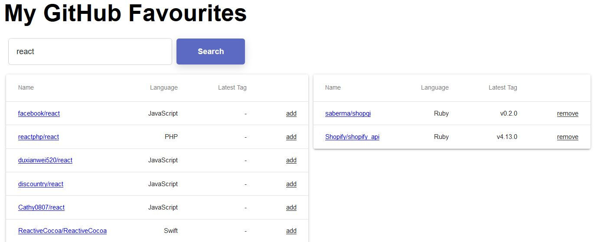

# Web Developer Intern Challenge

# Setup

```npm install --global gatsby-cli```
```gatsby build```
```gatsby develop```
```http://localhost:8000/```




## Requirements

Build a web app to search Github repositories, favourite repos, manage favourites.

- **Reproduce the designs** provided in the [screenshots](screenshots/desktop.jpg)
- Must use Github API **v3 or v4**
- Typing in the search input field should **NOT** perform an API call
- Hitting enter or clicking the "Search" button should perform an API call to Github
Performing a search should render a list of **10 repositories**
	- Each item should
		  - render the name with owner *(Ex. shopify/polaris)*
        and link to the repo's page on Github
		 - render the name of the primary language
		 - render the latest release tag **if present**
		 - render the "Add" button **if the repo is not already favourited**
		 - clicking the "Add" button should add the repo to the favourites list
        When the search input field is cleared, the list of results should cleared
         When the number of favourites is **more than one**
	    - render a **list of favourited repositories**
		Each item should
		- render the name with owner *(Ex. shopify/polaris)* and link to the repo's page on Github
		- render the name of the primary language
		- render the latest release tag if present
		- render the "Remove" button **if the repo has been favourited**
		- clicking the "Remove" button should remove the repo from the favourites list

## Notes
- [Github Developer](https://developer.github.com/)
- [Docs on how to create a personal access token to make request to the Github API](https://help.github.com/articles/creating-a-personal-access-token-for-the-command-line/)
